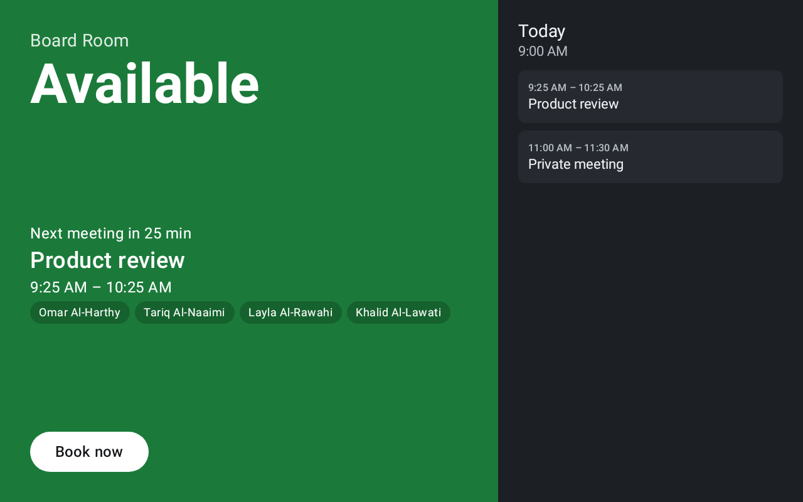
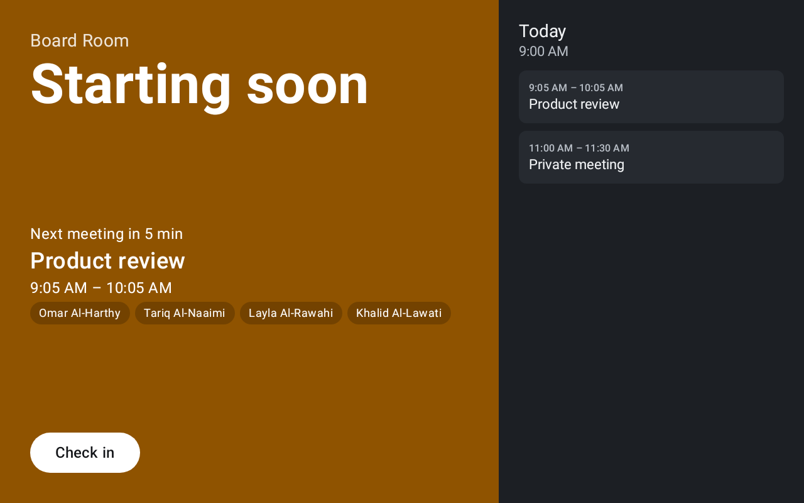
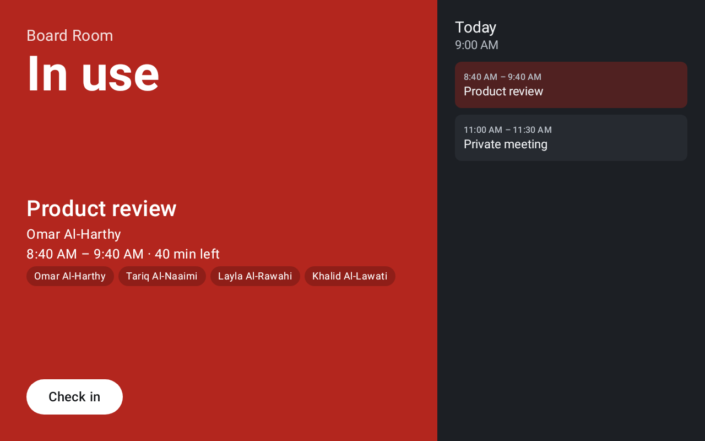
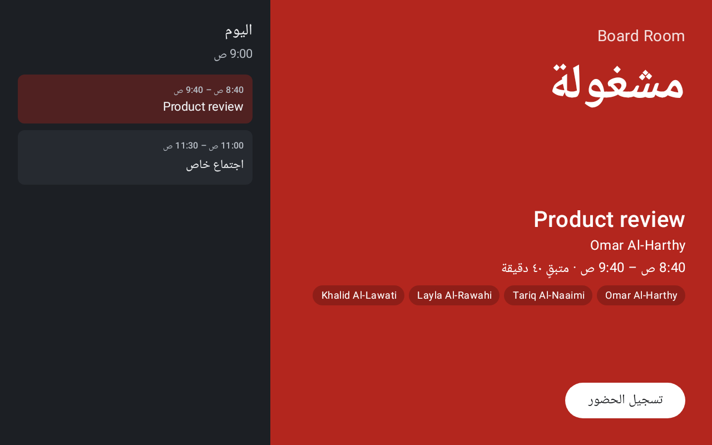
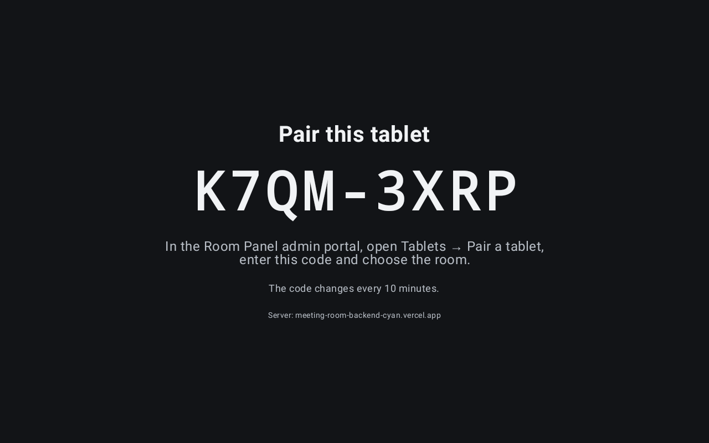
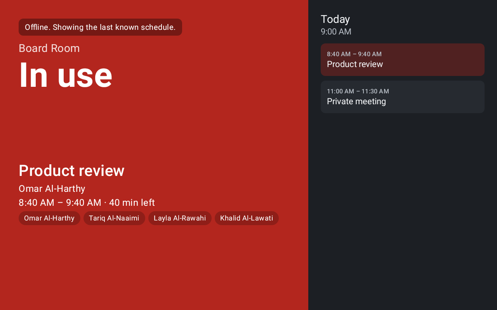

# Meeting Room Panel

An Android tablet app mounted outside a meeting room. It shows whether the room is free, what's on now and next, and who's attending. It also lets people book, extend, end or check in with a tap.

The room's calendar lives in **Microsoft 365** (an Exchange room mailbox), so bookings made in Outlook or Teams show up on the panel and panel bookings show up in Outlook and Teams. Google Workspace is planned.

- **Plan:** [docs/PLAN.md](docs/PLAN.md)
- **Research:** [competitors](docs/research/competitors.md) · [Microsoft 365 + Android kiosk](docs/research/technical.md)

| Free | Starting soon | In use | Arabic (RTL) |
|---|---|---|---|
|  |  |  |  |

| Pairing | Offline |
|---|---|
|  |  |

## Status

The panel talks to its backend, [`meeting-room-backend`](https://github.com/Tariq-AlNuaimi/meeting-room-backend) (Next.js on Vercel). The backend holds the Microsoft 365 connection.

| Works now | Not yet |
|---|---|
| Pairing by code (admin approves in the portal); Keystore-encrypted device token; auto re-pair when revoked | Microsoft 365 connected for real (needs the [admin setup](docs/m365-setup.md)) |
| Free / starting-soon / busy, day agenda, attendees per the room's privacy setting, private-meeting masking | Auto-release of no-shows, Teams join QR, LED bar |
| Book now, extend, end early, check in, through the backend | Silent self-update; remote unlock |
| "Offline / calendar unavailable" banner; actions disabled on stale data | |
| English + Arabic (RTL); kiosk lock, boot start, dimming outside working hours | |

**Setup guides:** [Microsoft 365 (admin)](docs/m365-setup.md) · [Tablet kiosk mode](docs/tablet-setup.md)

## Build

You need JDK 17+ and the Android SDK (platform 37). Android Studio provides both.

```bash
cd android
./gradlew testDebugUnitTest      # domain unit tests + screenshot tests
./gradlew assembleDebug          # app/build/outputs/apk/debug/app-debug.apk (talks to the Vercel backend)
./gradlew assembleDebug -PbackendUrl=demo                      # self-contained demo, sample meetings
./gradlew assembleDebug -PbackendUrl=https://your-backend.example # another backend
./gradlew lintDebug
./gradlew recordRoborazziDebug   # re-record screenshots after an intentional UI change
./gradlew verifyRoborazziDebug   # fail if the UI changed unexpectedly
```

Install on a tablet with USB debugging on: `adb install -r app/build/outputs/apk/debug/app-debug.apk`.

## Layout

```
android/app/src/main/java/com/rihal/roompanel/
  domain/   Meeting, RoomStatus calculator, BookingRules, BrightnessSchedule   (pure Kotlin, unit-tested)
  data/     AgendaRepository; RemoteAgendaRepository (backend), DemoAgendaRepository; DeviceCredentials (Keystore)
  data/api/ BackendClient (HTTPS + bearer), wire DTOs
  ui/       PanelViewModel, PanelScreen (Compose), Theme; pairing/ (code screen + polling)
  kiosk/    KioskPolicy (Device Owner lock-down), PanelDeviceAdminReceiver
android/app/src/debug/   adb-only kiosk exit (not in release builds)
docs/       plan and research
```

## Security model

The tablet **never** holds Microsoft credentials. A backend holds the Graph credentials, scoped by Exchange RBAC to room mailboxes only. The tablet pairs with a code and gets a revocable device token. App data is excluded from cloud backup and device transfer.
